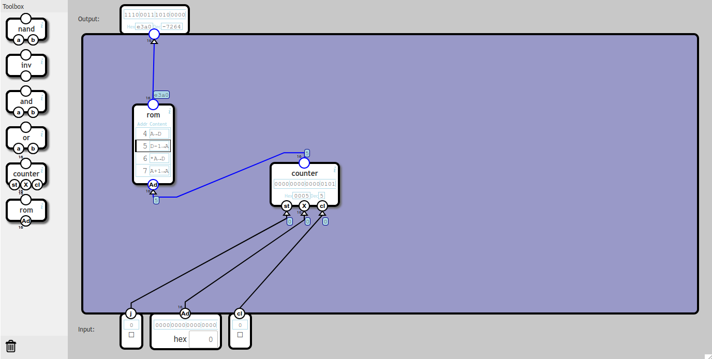

# [NandGame](http://nandgame.com/) solutions

## Table of Contents
  * [0 Logic Gates](#0-logic-gates)
    + [0.0 Invert](#00-invert)
    + [0.1 And](#01-and)
    + [0.2 Or](#02-or)
    + [0.3 Xor](#03-xor)
  * [1 Arithmetics](#1-arithmetics)
    + [1.0 Half Adder](#10-half-adder)
    + [1.1 Full Adder](#11-full-adder)
    + [1.2 Multi-bit Adder](#12-multi-bit-adder)
    + [1.3 Increment](#13-increment)
    + [1.4 Substraction](#14-substraction)
    + [1.5 Equal to zero](#15-equal-to-zero)
    + [1.6 Less then zero](#16-less-then-zero)
  * [2 Plumbing](#2-plumbing)
    + [2.0 Selector](#20-selector)
    + [2.0 Switch](#20-switch)
  * [3 Memory](#3-memory)
    + [3.0 Latch](#30-latch)
    + [3.1 Data Flip-Flop](#31-data-flip-flop)
    + [3.2 Register](#32-register)
    + [3.3 Counter](#33-counter)
    + [3.4 RAM](#34-ram)
  * [4 Arithmetic Logic Unit](#4-arithmetic-logic-unit)
    + [4.0 Unary ALU](#40-unary-alu)
    + [4.1 ALU](#41-alu)
    + [4.2 Opcodes](#42-opcodes)
    + [4.3 Condition](#43-condition)
  * [5 Processor](#5-processor)
    + [5.0 Combined Memory](#50-combined-memory)
    + [5.1 Instruction Detector](#51-instruction-detector)
    + [5.2 Control Unit](#52-control-unit)
    + [5.3 Program Engine](#53-program-engine)
    + [5.4 Computer](#54-computer)
    + [5.5 Input and Output](#55-input-and-output)

## 0 Logic Gates
### 0.0 Invert

### 0.1 And

### 0.2 Or

### 0.3 Xor

## 1 Arithmetics
### 1.0 Half Adder

### 1.1 Full Adder

### 1.2 Multi-bit Adder

### 1.3 Increment

### 1.4 Substraction

### 1.5 Equal to zero

### 1.6 Less then zero

## 2 Plumbing
### 2.0 Selector

### 2.0 Switch

## 3 Memory
### 3.0 Latch

### 3.1 Data Flip-Flop

### 3.2 Register

### 3.3 Counter

### 3.4 RAM

## 4 Arithmetic Logic Unit
### 4.0 Unary ALU

### 4.1 ALU

### 4.2 Opcodes

### 4.3 Condition

## 5 Processor
### 5.0 Combined Memory

### 5.1 Instruction Detector

### 5.2 Control Unit

### 5.3 Program Engine

### 5.4 Computer

### 5.5 Input and Output

